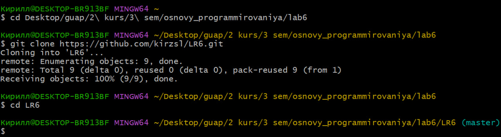
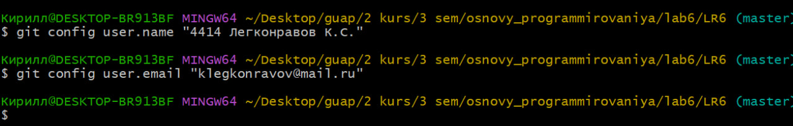
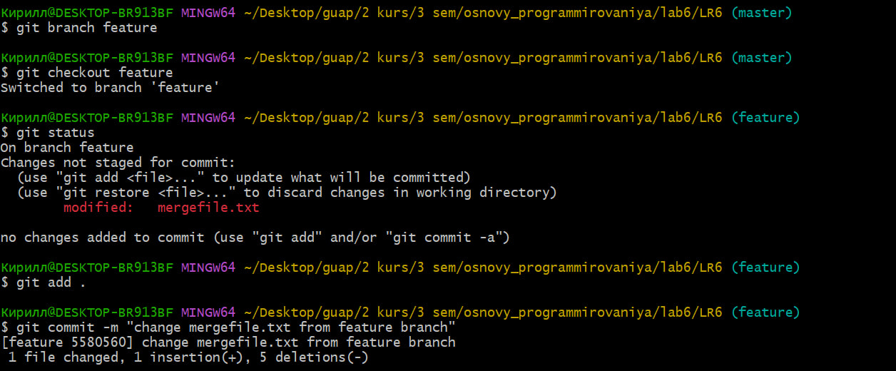
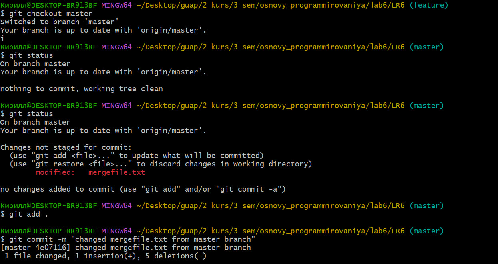
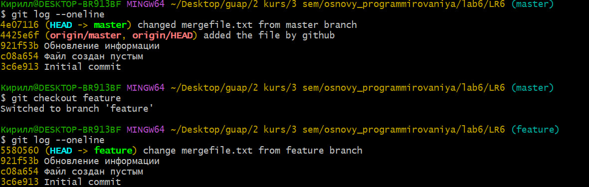
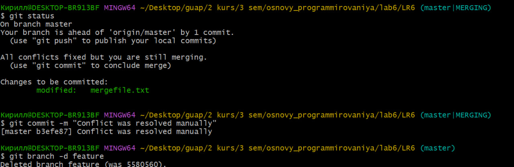
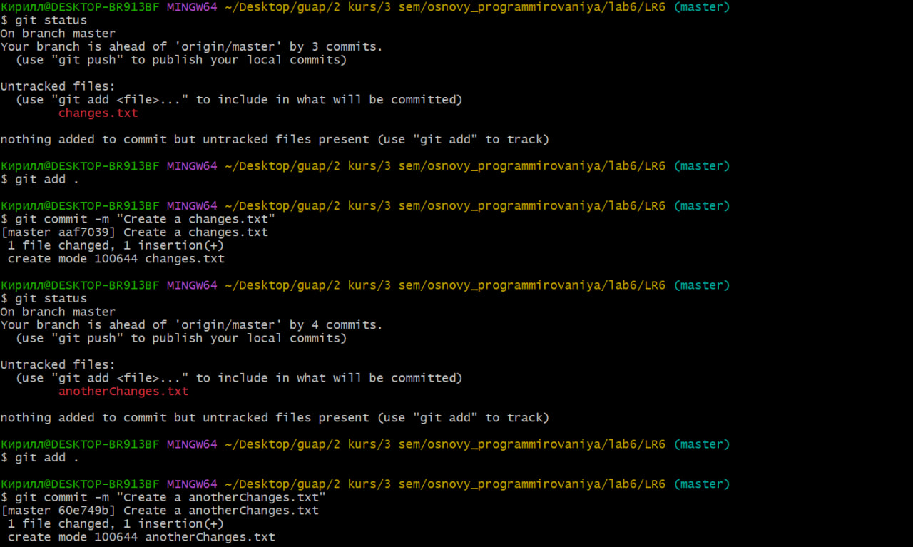
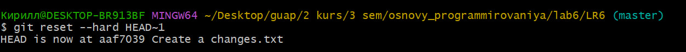

# Лабораторная работа № 6. Система контроля версий

## Цель работы

Изучение базовых возможностей системы управления версиями, опыт работы с Git Api, опыт работы с локальным и удаленным репозиторием.

## 1. Клон репозитория, настройка клиента git и добавление файла через интерфейс GitHub.

Для начала работы необходимо настроить клиент git (указать имя пользователя и электронную почту), а также клонировать личный удалённый репозиторий на компьютер. Для клонирования репозитория необходимо использовать команду git clone, это действие отображено на следующем скриншоте.



Настройка клиента git происходит при помощи команды git config (см. следующий скриншот).



При помощи интерфейса GitHub происходит создание файла, в котором указывается любой текст (например, added file by GitHub).

## 2. Получение истории операций каждой из веток, просмотр изменений и выполнение слияния в ветку master.

Следующий шаг - слияние веток. Это важный этап, так как на нём может появиться проблема слияния файлов с одинаковых названием, что необходимо исправить. Для начала происходит создание новой ветки с помощью git branch "название ветки", для перехода в неё используется git checkout "название ветки". При изменении mergefile с помощью git status надо удостовериться, что изменения были внесены, после чего следует коммит с понятным названием внесённых изменений.



Аналогичные действия необходимо произвести и в главной ветке, для этого осуществляется обратный переход при помощи той же команды.



В качестве убеждения и проверки в достоверности выполненных действий выполняется просмотр истории операций при помощи команды git log, где в качестве параметра указывается oneline, позволяющий выводить информацию с новой строки.



Именно на данном этапе происходит конфликт, который разрешается вручную путём удаления информации из побочной ветки, то есть производится слияние в ветку master. Осуществляется проверка с помощью git status, после чего коммит и удаление ветки feature.



## 3. Применение изменений, их фиксация и откат.
Производится создание файла changes.txt, в котором добавлен какой-либо текст, осуществляется проверка выполнения и последующий коммит. Все использованные команды уже были перечислены выше.



По условию задания происходит откат коммита.



## 4. Лог команд

```bash

1  git clone https://github.com/kirzsl/LR6.git

2  cd LR6

3  git config user.name "4414 Легконравов К.С."

4  git config user.email "klegkonravov@mail.ru"

5  git branch feature

6  git checkout feature

7  git status

8  git add .

9  git commit -m "change mergefile.txt from feature branch"

10  git checkout master

11  git status

12  git status

13  git add .

14  git commit -m "changed mergefile.txt from master branch"

15  git log --oneline

16  git checkout feature

17  git log --oneline

18  git status

19  git commit -m "Conflict was resolved manually"

20  git branch -d feature

21  git status

22  git add .

23  git commit -m "Create a changes.txt"

24  git status

25  git add .

26  git commit -m "Create a anotherChanges.txt"

27  git reset --hard HEAD~1

```

## 5. История операций

```bash

017b008 | 2025-11-16 | 4414 Легконравов К.С. | Edited the second step, added history of branch operations. Started and filled third step, made two commits and did reset last of them.

be689aa | 2025-11-16 | 4414 Легконравов К.С. | Continue fill report, added second step (change mergefile from main and feature branch, resolv the conflict)

8d393ce | 2025-11-16 | 4414 Легконравов К.С. | added the screenshots folder and completed first step of report (clone repository, input personal data and add file by GitHub)

aaf7039 | 2025-11-15 | 4414 Легконравов К.С. | Create a changes.txt

b3efe87 | 2025-11-15 | 4414 Легконравов К.С. | Conflict was resolved manually

4e07116 | 2025-11-15 | 4414 Легконравов К.С. | changed mergefile.txt from master branch

5580560 | 2025-11-15 | 4414 Легконравов К.С. | change mergefile.txt from feature branch

4425e6f | 2025-11-15 | kirzsl | added the file by github

921f53b | 2020-11-21 | Kurtyanik | Обновление информации

c08a654 | 2020-11-21 | Kurtyanik | Файл создан пустым

3c6e913 | 2020-11-21 | Kurtyanik | Initial commit

```

## 6. Выводы
В данной работе были изучены базовые команды для работы с личным и удалённым репозиторием в системе управления версиями. Работа проводилась в среде Git Bash, были использованы команды git pull, git clone, git add, git commit, git checkout, git merge и др.

